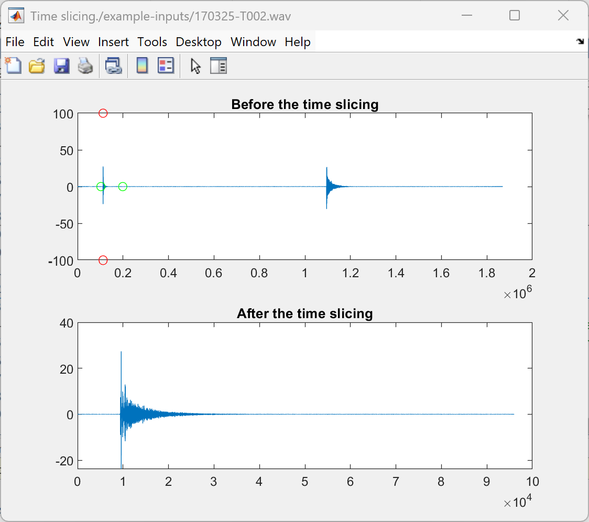
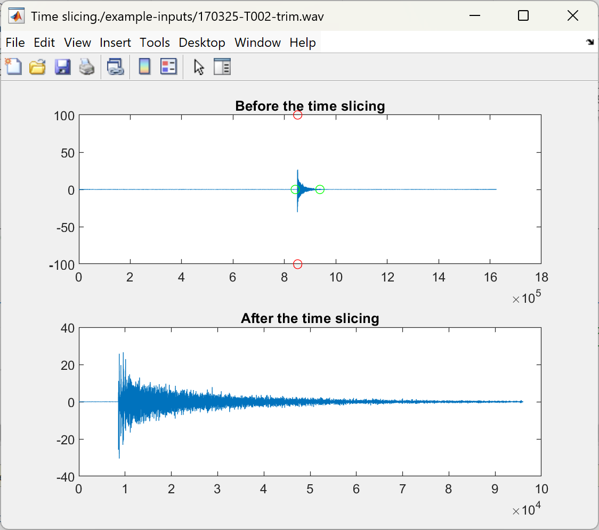

# Automated IR processing for the Agorà project
Based on https://github.com/xorgol/MIMO_Matlab
**WARNING**: the Ambeo part is still untested!

Run eigenmike.m for the EM64, select a folder, it will process every .w64 file in its subfolders.
You can also edit line 99 to process .wav files.

Run agora_automated.m for the Zoom F8, where channels 1-4 are assumed to be the Ambeo, channels 5-6 are the Neumann dummy head, channel 7 is the Behringer omni.
This one is not as well tested, so I haven't implemented batch processing of entire folders, you need to write the path to the file that you want to process on line 17.
The most common problem is with the trimming, if the file contains the tail of the previous sweep it can select the wrong part.
This is very noticeable in the graph, if you notice it you can just trim the file before processing.

This is wrong:

And this is right:

Both scripts convolve with the inverse sweep, then apply appropriate A-to-B convolution matrices.

Finally, both scripts compute the acoustical parameters using a compiled version of the Acoustical Parameters module from Aurora.
The results are stored in appropriately named text files. 

acoupar_omni.txt is for the acoustical parameters computed from the Behringer omnidirectional microphone.
acoupar_BIN.txt is for the acoustical parameters computed from the binaural dummy head.
acoupar_PU.txt is for the acoustical parameters computed from the W and Y channels of the Ambisonics IR, both from the Eigenmike and from the Ambeo.